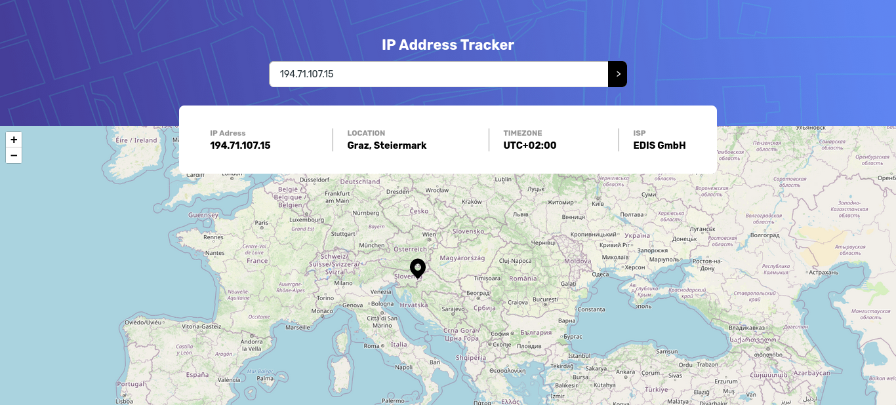

# Frontend Mentor - IP address tracker solution

This is a solution to the [IP address tracker challenge on Frontend Mentor](https://www.frontendmentor.io/challenges/ip-address-tracker-I8-0yYAH0). Frontend Mentor challenges help you improve your coding skills by building realistic projects.

## Table of contents

- [Overview](#overview)

  - [The challenge](#the-challenge)
  - [Screenshot](#screenshot)
  - [Links](#links)
  - [Built with](#built-with)
  - [What I learned](#what-i-learned)
  - [Continued development](#continued-development)

- [Author](#author)

## Overview

Used [leafletjs](https://leafletjs.com/index.html) for maps and [geoipify](https://geo.ipify.org/) to get location details from ip address.

### The challenge

Users should be able to:

- View the optimal layout for each page depending on their device's screen size
- See hover states for all interactive elements on the page
- See their own IP address on the map on the initial page load
- Search for any IP addresses or domains and see the key information and location

### Screenshot

### Links

- Solution URL: [source code](https://github.com/JithinAji/ip-address-tracker)
- Live Site URL: [check the site](https://jithinaji.github.io/ip-address-tracker/)

### Built with

- Semantic HTML5 markup
- CSS custom properties
- Flexbox
- CSS Grid
- Mobile-first workflow
- [Vuejs](https://vuejs.org/) - JS library

### What I learned

I practiced reading the documentation of api(laflet and ipify) to use them effectively.

There are four Vue components used:

- App - root component
  - Header - Top bar of page containing both Card and Inputbox component
    - Card - To show the fetched ip details
    - Inputbox - input field where user can provide IP address
  - Maps - Component which contains the map

### Continued development

Validation need to be done for IP address.

## Author

- Website - [Jithin Aji](https://jithinaji.github.io/portfolioversion2/)
- Frontend Mentor - [@yourusername](https://www.frontendmentor.io/profile/yourusername)
- Twitter - [@AjiJithin](https://twitter.com/AjiJithin)
